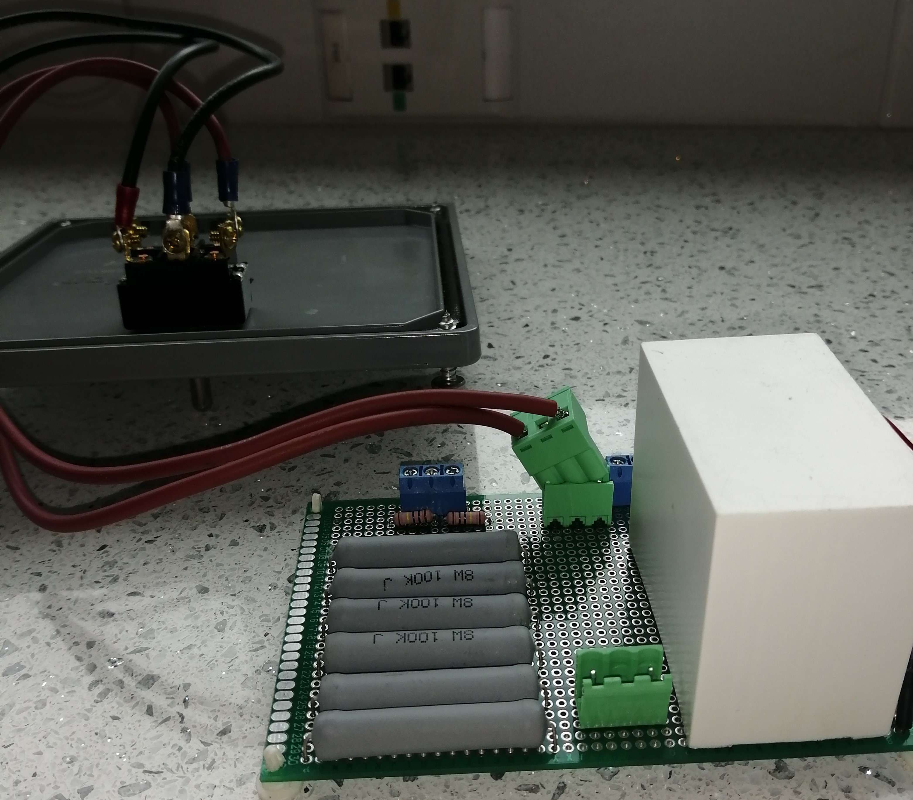
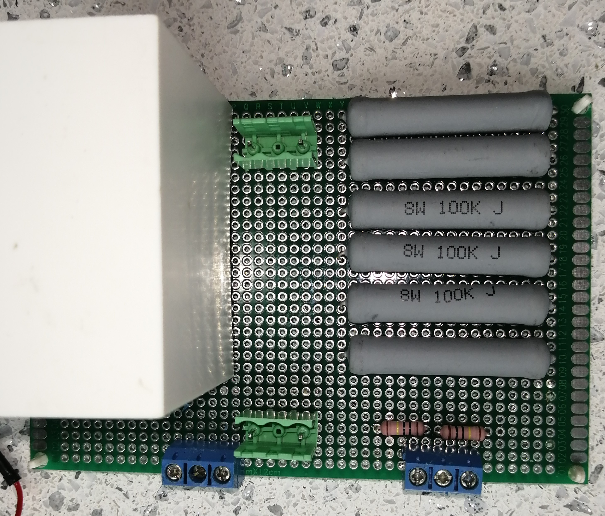
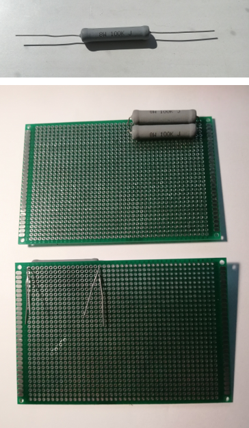
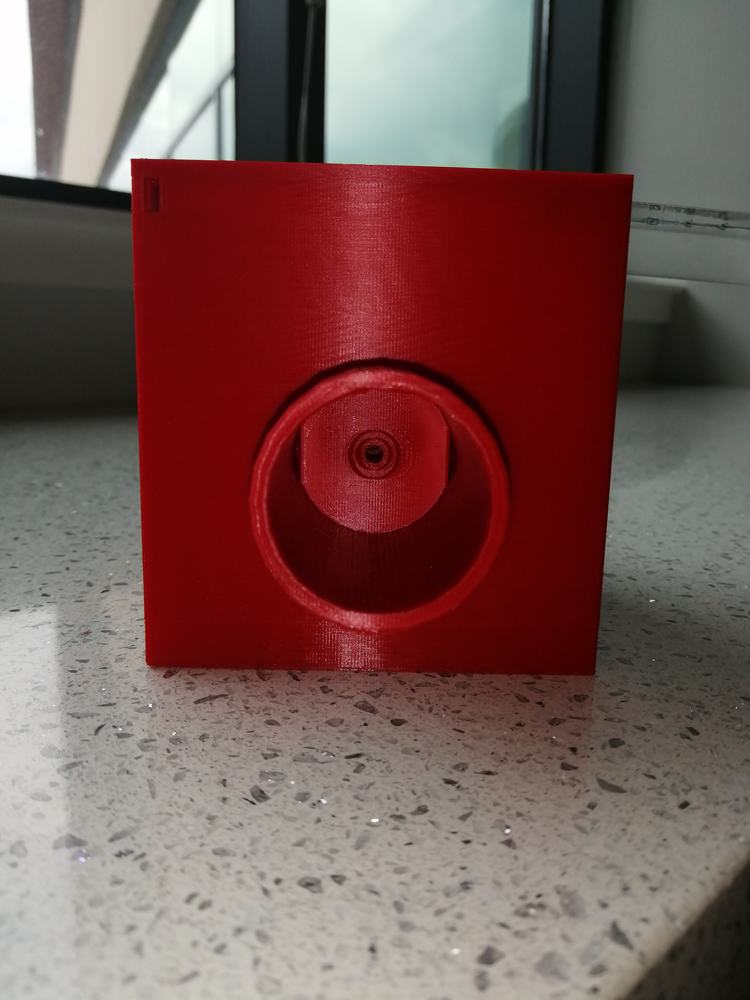
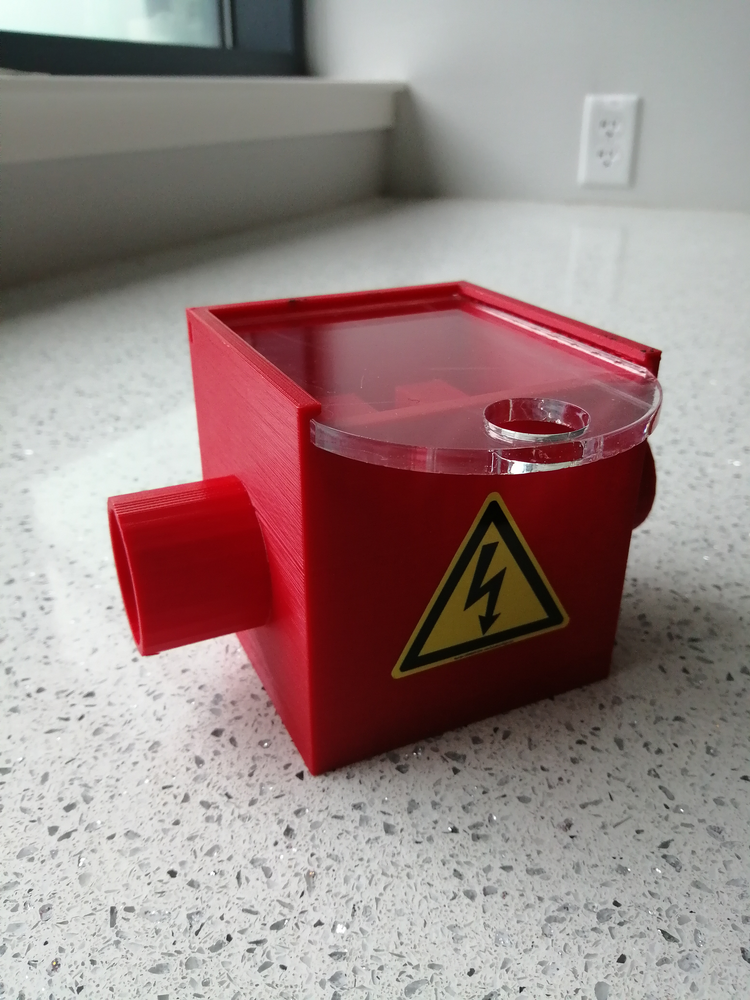
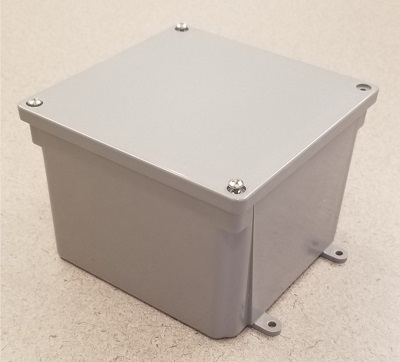

<h2>
<em>Dictyostelium</em> <em>discoideum</em> Electroporator
</h2>

<a href="https://minhaskamal.github.io/DownGit/#/home?url=https://github.com/Dicty-Electroporator/Dicty-Electroporator.github.io/tree/master/Dictyostelium%20discoideum%20Electroporator">Download Project</a>

<strong>Abstract:&nbsp;</strong>Custom-made, inexpensive and open-source electroporation apparatus for <em>Dictyostelium discoideum</em> with all functional modules and peripherals.

<strong>Description:&nbsp;</strong>Electroporation to introduce DNA into cells is a common technique in genetic engineering. Dictyostelium discoideum is a well-established eukaryotic model organism that is frequently genetically modified (transformed). We present here an electroporator capable of high efficiency D. discoideum transformation. Our electroporator consists of a high voltage power supply, pulse generator circuit and cell sample cuvette holder. The power supply is programmed to deliver desired voltage, which when activated by a double-pole, double-throw switch (DPDT below) charges the capacitor. Further switching allows the charged capacitor to deliver a precise, consistent exponential decay wave of the proper duration to the cuvette containing a D. discoideum cell and DNA mixture. The high-voltage circuit is housed in an electrically insulated enclosure - we chose a plastic electrical junction box with appropriate holes for switch mounting and cables to pass.  A 3D printable cuvette holder was designed and is available in .stl, .dwg and .iges formats. An electrophoresis chamber cover with cables was used as an adapter for banana plug/jack connections to the power supply. Integral in development and testing was an inexpensive 1,000-volt digital multimeter. To provide hands-free monitoring of discharge circuit voltage and monitoring of the real-time capacitor voltage, we connected the multimeter to the cuvette holder or to the capacitor plates with 24-inch male-male banana test leads or alligator clips, respectively. At the end of these instructions we have included safety and durability enhancements for a second generation prototype.

<strong>License:&nbsp;</strong>CERN Open Hardware License

<h1>
2nd Generation Enhanced Prototype
</h1>

For those concerned with a more durable and potentially safer device we have also constructed and tested an additional prototype with a minimal increase in cost. The second prototype features a soldered breadboard with higher power components. Assembly of the pulse generator circuit is straightforward and can be constructed by a beginner with access to soldering equipment. Improved safety features include an inverted capacitor on a circuit board that is solid state. The second prototype cuvette chamber requires more print media but includes an enclosure with more limited access to the power connectors as well as a clear removable lid. The 3D design and print files are available on this page. Note that we chose a biodegradable and fire-resistant 3D print media. There are other cost effective, readily available, and more durable print media available. The enhanced system was tested and performs as efficiently as the original prototype.

A soldered Pulse Generator was made with much higher wattage resistors and terminal plugs for the switch.

&nbsp;

For a more durable device 2W-1M Ohm resistors were used for the anti-no-load shutoff resistors R1-R2 and bleed down resistors R9-R12. 8W-100k Ohm resistors were used for charge-side current limiting shutoff resistors R3-R8.

&nbsp;

The components were fixed to the breadboard using the long leads of resistors as traces on the underside of the 8cm x 12cm padboard.

Trimmed resistor terminals were used to create any additional traces. This technique can easily be found on the internet. While the circuit diagram has remained unchanged, the new board layout accommodates the lack of premade traces found on solderless breadboards. In addition, two jumper wires were soldered to the component side at each end of the bleed-down resistor array. This modification allows the real-time monitoring of the capacitor voltage during electroporation and provides assurance the capacitor is safe. This is accomplished by connecting the 1kV digital multimeter to the jumper wires using alligator clips passed through newly drilled holes in the enclosure. The same digital multimeter used for performing a functions check may be used.

&nbsp;

<h2>
2nd generation enhanced cuvette chamber
</h2>

The second-generation enhanced prototype cuvette holder has several additional safety features. The original cuvette holder is now enclosed in a four-sided box with a removable clear Poly acrylic lid. Collars have been enlarged to add additional protection from shock exposure. Design and print files have been included below and the chamber can be printed either hollow or solid.

<strong>Print File2:&nbsp;<a href="https://github.com/Dicty-Electroporator/Dicty-Electroporator.github.io/raw/master/Enhanced%20Cuvette%20Chamber%203DPrintSTL.stl">Enhanced Cuvette Chamber.stl</a></strong>

<strong>CAD Design File2:&nbsp;<a href="https://github.com/Dicty-Electroporator/Dicty-Electroporator.github.io/raw/master/Enhanced%20Cuvette%20Chamber%20CAD.dwg">Enhanced Cuvette Chamber.dwg</a></strong>

FreeCAD Open Source IGES Design File: Available in Download Project top of page

<strong>Enclosure Lid Print File:&nbsp;<a href="https://github.com/Dicty-Electroporator/Dicty-Electroporator.github.io/raw/master/Enclosure%20Lid%20STL.stl">Enclosure Lid STL.stl</a></strong>

<strong>Enclosure Lid CAD Design File:&nbsp;<a href="https://github.com/Dicty-Electroporator/Dicty-Electroporator.github.io/raw/master/Enclosure%20Lid%20CAD.dwg">Enclosure Lid CAD.dwg</a></strong>

Laser Cut Enclosure Lid SVG File: Available in Download Project top of page

FreeCAD Open Source IGES Design File: Available in Download Project top of page
 

&nbsp;

<h2>
Additional parts required for the enhanced prototype
</h2>

<table>
<thead>
<tr>
<td>

<strong>Part</strong>

</td>
 
<td>

<strong>Quantity</strong>

</td>
 
<td>

<strong>Supplier</strong>

</td>
 
<td>

<strong>Supplier part number</strong>

</td>
 
<td>

<strong>URL</strong>

</td>
</tr>
</thead>
  
 <tr>    
<td>

Power supply banana plug test leads 60 inch

</td>
 
<td>

1-2

</td>
 
<td>

Mouser

</td>
 
<td>

4911A-60/4911A-62

</td>
 
<td>

<a href="https://www.mouser.com/Search/Refine?Keyword=4911a-60">www.mouser.com</a>

</td>
 </tr>
  <tr>
<td>

PCB Prototype padboard - 8cm x 12cm

</td>
 
<td>

1

</td>
 
<td>

Amazon

</td>
 
<td>

739340318574

</td>
 
<td>

<a href="https://www.amazon.com/gp/product/B07Y3DVM1W/ref=ppx_yo_dt_b_asin_title_o05_s00?ie=UTF8&psc=1">www.amazon.com</a>

</td>
 </tr> 
  <tr>
<td>

Resistors - 8W-100k Ohm

</td>
 
<td>

6

</td>
 
<td>

Mouser

</td>
 
<td>

279-ROX8J100K

</td>
 
<td>

<a href="https://www.mouser.com/ProductDetail/TE-Connectivity-Holsworthy/ROX8J100K?qs=gZXFycFWdAMYKZPoGrub8g%3D%3D">www.mouser.com</a>

</td>
 </tr> 
  <tr>
<td>

Resistors - 2W-1M Ohm

</td>
 
<td>

6

</td>
 
<td>

Mouser

</td>
 
<td>

594-5083NW1M000J

</td>
 
<td>

<a href="https://www.mouser.com/ProductDetail/Vishay-BC-Components/PR02000201004JR500?qs=LCMWAU1DZcwmgZ1lvVsGww%3D%3D">www.mouser.com</a>

</td>
 </tr>
  <tr>
<td>

Bio-Rad Model 3000xi Computer Controlled Electrophoresis Power Supply

</td>
 
<td>

1

</td>
   
<td>

ebay

</td>
   

   
<td>

<a href="https://www.ebay.com">www.ebay.com</a>

</td>

  <tr>
<td>

3-Pin 5.08mm Pitch Male Female Plug-in PCB Screw Terminal Block Connector

</td>
   
<td>

2

</td>
   
<td>

Amazon

</td>
   
<td>

0766832280286

</td>
<td>

<a href="https://www.amazon.com/PoiLee-5-08mm-Female-Terminal-Connector/dp/B07TQLYQ7W/ref=asc_df_B07TQLYQ7W/?tag=hyprod-20&linkCode=df0&hvadid=385629037133&hvpos=&hvnetw=g&hvrand=8172029133657464055&hvpone=&hvptwo=&hvqmt=&hvdev=c&hvdvcmdl=&hvlocint=&hvlocphy=9005131&hvtargid=pla-846156762614&psc=1&tag=&ref=&adgrpid=73872201970&hvpone=&hvptwo=&hvadid=385629037133&hvpos=&hvnetw=g&hvrand=8172029133657464055&hvqmt=&hvdev=c&hvdvcmdl=&hvlocint=&hvlocphy=9005131&hvtargid=pla-846156762614">www.amazon.com</a>

 </tr?
  

&nbsp;

<strong>Requires:</strong>

<ul>
<li>Pulse Generator&nbsp;<strong>x&nbsp;1,&nbsp;</strong>Cuvette Holder&nbsp;<strong>x&nbsp;1,&nbsp;</strong>Multimeter&nbsp;<strong>x&nbsp;1,&nbsp;</strong>1KV DC Power supply (e.g., Bio-Rad PowerPac 1000+)&nbsp;<strong>x&nbsp;1,&nbsp;</strong>Red banana plug test lead - 24 inch&nbsp;<strong>x&nbsp;1,&nbsp;</strong>Black banana plug test lead - 24 inch&nbsp;<strong>x&nbsp;1,&nbsp;</strong>Horizontal Gel Electrophoresis System&nbsp;<strong>x&nbsp;1</strong></li>
</ul>

<h3>
Assembly instruction
</h3>

<strong>Step&nbsp;1.&nbsp;</strong>Plug electroporator power supply leads into gel electrophoresis lid.

<strong>Step&nbsp;2.&nbsp;</strong>Plug electrophoresis lid leads into power supply.

<strong>Step&nbsp;3.&nbsp;</strong>Plug electroporator cuvette leads into cuvette holder.

<strong>Step&nbsp;4.&nbsp;</strong>Plug 24-inch male-male banana test leads into digital multimeter and the other end into the female end of stackable banana jacks of Step 2.

<strong>Step&nbsp;5.&nbsp;</strong>Perform functions check: power on the digital multimeter, set to measure voltage (up to 1KV), and charge &amp; discharge the capacitor with the pulse generator switch at lower voltage (e.g. 75V). If the device is functioning correctly, when the discharge begins the multimeter will display approximately 75V and go to ~50V volts in about 30sec.

&nbsp;

<h2>
Enclosure
</h2>

<strong>Description:&nbsp;</strong>We chose to purchase a commercially available plastic junction box to enclose our pulse generator circuit. A 13mm hole was drilled into the enclosure cover for the DPDT and 22mm holes were marked and drilled in the enclosure which provided a nice fit for the plastic NM connectors and pass-through cables.

<strong>Requires:</strong>

<ul>
<li>Junction box&nbsp;<strong>x&nbsp;1</strong></li>
</ul>
<h4>
Assembly instruction
</h4>

<strong>Step&nbsp;1.&nbsp;</strong>Drill two 22mm holes in any side of the enclosure with centers at 34mm from the exterior bottom and horizontally 46mm apart on center. It might be helpful to label one hole &ldquo;Power supply&rdquo; and the other &ldquo;Cuvette holder&rdquo;.

<strong>Step&nbsp;2.&nbsp;</strong>Drill 13mm hole in enclosure lid for switch mounting. Place the hole where hand-switching will be most comfortable.

&nbsp;

<h2>
Pulse Generator
</h2>

<strong>Description:&nbsp;</strong>Components and configurations of the electrical circuit are described here. For all connections, refer to the circuit diagram and photos of the assembled circuit.

<strong>Requires:</strong>

<ul>
<li>400 Point solderless breadboard&nbsp;<strong>x&nbsp;2,&nbsp;</strong>24AWG Male-Male fixed length jumper wires&nbsp;<strong>x&nbsp;5,&nbsp;</strong>Test Lead Wire 25 ft. red&nbsp;<strong>x&nbsp;1,&nbsp;</strong>Test Lead Wire 25 ft. black&nbsp;<strong>x&nbsp;1,&nbsp;</strong>26AWG Male-Male flexible jumper wires&nbsp;<strong>x&nbsp;9,&nbsp;</strong>Capacitor - 25microF 1.3kV&nbsp;<strong>x&nbsp;1,&nbsp;</strong>Red banana plug test lead - 60 inch&nbsp;<strong>x&nbsp;1,&nbsp;</strong>Black banana plug test lead - 60 inch&nbsp;<strong>x&nbsp;1,&nbsp;</strong>Ring Terminals&nbsp;<strong>x&nbsp;4,&nbsp;</strong>Resistor - 1M Ohm 1/2W&nbsp;<strong>x&nbsp;6,&nbsp;</strong>Resistor - 100k Ohm 2W&nbsp;<strong>x&nbsp;6,&nbsp;</strong>14-26 AWG 3-Position Screw Terminal Block&nbsp;<strong>x&nbsp;4,&nbsp;</strong>15A AC DPDT toggle switch&nbsp;<strong>x&nbsp;1,&nbsp;</strong>Plastic NM Connector&nbsp;<strong>x&nbsp;2,&nbsp;</strong>Enclosure&nbsp;
<strong>x&nbsp;1</strong></li>
</ul>

&nbsp;

<h3>
Assembly instruction
</h3>

&nbsp;

<strong>Step&nbsp;1.&nbsp;</strong>Cut 4 pieces of 18 AWG wire (for the switch) to 30cm lengths and strip approx. 5mm of bare wire from each end. Crimp one end of each wire to a ring terminal.

&nbsp;

<strong>Step&nbsp;2.&nbsp;</strong>Attach ring terminals (with wire from step 1) to terminals 2, 3, 4, and 5 of the DPDT switch. Install switch into hole drilled into lid of case.

&nbsp;

<strong>Step&nbsp;3.&nbsp;</strong>Using the 4 pieces of 18 AWG wire with ring terminals from step 1, connect switch terminals 2 and 3 to the outboard ports of one terminal block and 4 and 5 to the outboard ports of another terminal block by inserting paired wires into outside wire cages of terminal blocks, then tighten terminal block screws.

&nbsp;

<strong>Step&nbsp;4.&nbsp;</strong>Clip resistor pins and bend at 90-degree angle to fit into breadboard terminals.

&nbsp;

<strong>Step&nbsp;5.&nbsp;</strong>Connect six 100K Ohm - 2W resistors (R3-R8) in parallel into breadboards using jumper wires as needed to form connections.

&nbsp;

<strong>Step&nbsp;6.&nbsp;</strong>Connect two 1M Ohm - 1/2W resistors (R1 and R2) in series into breadboards using jumper wires as needed to form connections.

&nbsp;

<strong>Step&nbsp;7.&nbsp;</strong>Connect four 1M Ohm - 1/2W resistors (R9-R12) in series. A short jumper wire is also placed on the board as shown (lower right section of breadboard) that will become a link between terminal blocks from steps 2, 3, 9 and 10.

&nbsp;

<strong>Step&nbsp;8.&nbsp;</strong>Ensure the 25microF - 1,300V capacitor is not charged before handling by measuring voltage across the terminals using the multimeter. Connect three 20cm flexible jumper wires to each pole of capacitor. Note that two leads from each capacitor pole are present. Wire terminals can be crimped around capacitor leads or soldered for establishing a more permanent connection. Attach capacitor leads to breadboard per circuit diagram.

&nbsp;

<strong>Step&nbsp;9.&nbsp;</strong>Connect terminal blocks from switch leads to breadboard (see step 3).

&nbsp;

<strong>Step&nbsp;10.&nbsp;</strong>Cut 1 red and 1 black 60 in. test lead in half. Strip cut ends to leave approximately 5mm of bare wire. It might be helpful to tape the two pairs of one red and one black wire together every few centimeters. Pass stripped wire ends through NM plastic connectors about 10cm. Connect terminal blocks to the stripped ends by inserting paired wires into outside wire cages of terminal blocks, then tighten terminal block screws. Push NM plastic connectors into the cable pass-through holes of the enclosure.

&nbsp;

<strong>Step&nbsp;11.&nbsp;</strong>Pull the terminal block ends of the power supply and cuvette holder cables further through the pass-through holes with only sufficient play to insert the terminal blocks into the appropriate places on the breadboards.

&nbsp;

<strong>Step&nbsp;12.&nbsp;</strong>Adhere the breadboards and capacitor to the inside base of the enclosure. While we used 2-sided tape, glue could be used for a more permanent solution. Connect power supply and cuvette holder terminal blocks to breadboard.

&nbsp;

<strong>Step&nbsp;13.&nbsp;</strong>Attach enclosure cover.

&nbsp;

<h2>
Cuvette Holder
</h2>

<strong>Description:&nbsp;</strong>The cuvette holder provides the delivery vehicle for the electric field that causes electroporation. It is also notable that the cuvette holder was designed to keep inward pressure on the plug ends that contact the cuvette. It was an important consideration in our design to provide hands-free electroporation and the built-in spring-like nature of the resulting connection ensures constant contact - even when like charges build up on each plug and its corresponding cuvette contact - a force that opposes contact. It is also notable that we chose stackable banana plugs so that we could tandem a 1,000V multimeter to the cuvette holder - especially useful during pre-electroporation functions check.

<strong>Requires:</strong>

<ul>
<li>3D printed cuvette holder&nbsp;<strong>x&nbsp;1</strong></li>
</ul>
<h4>
Assembly instruction
</h4>

<strong>Step&nbsp;1.&nbsp;</strong>3D print a Cuvette holder in PLA semi-hollow and without support. A print file is available below in STL format. An editable design file in DWG format is also available below. The DWG file was created in AutoCAD student edition which is free for students. The DWG file is also editable in several open-source CAD packages including DraftSight, Autodesk 123D Design, nanoCAD, AutoCAD Mobile and DoubleCAD XT. Another open-source CAD package we have accommodated is FreeCAD, which can edit IGES files. An IGES design file is available through the link Download Project at the top of this page.

<strong>Print File:&nbsp;<a href="https://github.com/Dicty-Electroporator/Dicty-Electroporator.github.io/raw/master/Cuvette%20Holder.stl">Cuvette Holder.stl</a></strong>

<strong>CAD Design File:&nbsp;<a href="https://github.com/Dicty-Electroporator/Dicty-Electroporator.github.io/raw/master/Cuvette%20Holder.dwg">Cuvette Holder.dwg</a></strong>

FreeCAD Open Source IGES Design File:&nbsp;Available in Download Project top of page

&nbsp;

<h2>
Authors
</h2>
<table>
<thead>
<tr>
<td>

<strong>Name</strong>

</td>
<td>

<strong>E-mail</strong>

</td>
<td>

<strong>Affiliation</strong>

</td>
<td>&nbsp;</td>
</tr>
</thead>
<tbody>
<tr>
<td>

Michael Cauchy

</td>
<td>

mcauchy@oswego.edu

</td>
<td>

State University of New York at Oswego

</td>
<td>&nbsp;</td>
</tr>
<tr>
<td>

Ali A. Khan

</td>
<td>

akhan3@oswego.edu

</td>
<td>

State University of New York at Oswego

</td>
<td>&nbsp;</td>
</tr>
<tr>
<td>

Yulia Artemenko

</td>
<td>

yulia.artemenko@oswego.edu

</td>
<td>

State University of New York at Oswego

</td>
<td>&nbsp;</td>
</tr>
<tr>
<td>

David A. Dunn

</td>
<td>

david.dunn@oswego.edu

</td>
<td>

State University of New York at Oswego

</td>
<td>&nbsp;</td>
</tr>
</tbody>
</table>
<h2>
Total bill of materials for this project
</h2>
<table>
<thead>
<tr>
<td>

<strong>Part</strong>

</td>
<td>

<strong>Quantity</strong>

</td>
<td>

<strong>Supplier</strong>

</td>
<td>

<strong>Supplier part number</strong>

</td>
<td>

<strong>URL</strong>

</td>
</tr>
</thead>
<tbody>
<tr>
<td>

400 Point solderless breadboard

</td>
<td>

2

</td>
<td>

Jameco

</td>
<td>

2157693

</td>
<td>

<a href="http://www.jameco.com">www.jameco.com</a>

</td>
</tr>
<tr>
<td>

Male-Male fixed length jumper wires

</td>
<td>

5

</td>
<td>

Jameco

</td>
<td>

2127718

</td>
<td>

<a href="https://www.jameco.com/z/WJW-70B-5-70-Piece-Jumper-Wire-Kit-22AWG-14-Lengths-10-Colors_2127718.html">www.jameco.com</a>

</td>
</tr>
<tr>
<td>

Test Lead Wire 25 in. red

</td>
<td>

1

</td>
<td>

Powerwerx

</td>
<td>

Wire-TL-18-00-25

</td>
<td>

<a href="https://powerwerx.com/test-lead-rubber-flexible-wire">powerwerx.com</a>

</td>
</tr>
<tr>
<td>

Test Lead Wire 25 in. black

</td>
<td>

1

</td>
<td>

Powerwerx

</td>
<td>

Wire-TL-18-00-25

</td>
<td>

<a href="https://powerwerx.com/test-lead-rubber-flexible-wire">powerwerx.com</a>

</td>
</tr>
<tr>
<td>

Male-Male flexible jumper wires

</td>
<td>

9

</td>
<td>

Mouser

</td>
<td>

KIT-ZWx4

</td>
<td>

<a href="https://www.mouser.com/ProductDetail/BusBoard-Prototype-Systems/KIT-ZWx4?qs=sGAEpiMZZMvh1pRuiUVjFZ0aAJXGPyuNDJiA5Z8ZR2Q%2FfInvTU3aKA%3D%3D">www.mouser.com</a>

</td>
</tr>
<tr>
<td>

Capacitor - 25microF - 1,300V

</td>
<td>

1

</td>
<td>

Mouser

</td>
<td>

C4AQUBW5250A3NJ

</td>
<td>

<a href="https://www.mouser.com/ProductDetail/KEMET/C4AQUBW5250A3NJ?qs=%2Fha2pyFadugKSuBjMOjke5u9ridkq4YeClSJSpnddrBZ2GZPnEOejQ%3D%3D">www.mouser.com</a>

</td>
</tr>
<tr>
<td>

Red banana plug test lead - 60 inch

</td>
<td>

1

</td>
<td>

Mouser

</td>
<td>

B-60-2

</td>
<td>

<a href="https://www.mouser.com/ProductDetail/Pomona-Electronics/B-60-2?qs=sGAEpiMZZMv8kklI404QlQaMEaX1aQ14">www.mouser.com</a>

</td>
</tr>
<tr>
<td>

Black banana plug test lead - 60 inch

</td>
<td>

1

</td>
<td>

Mouser

</td>
<td>

B-60-0

</td>
<td>

<a href="https://www.mouser.com/ProductDetail/Pomona-Electronics/B-60-0?qs=sGAEpiMZZMv8kklI404QlV4QPmgLmIZb">www.mouser.com</a>

</td>
</tr>
<tr>
<td>

Ring Terminals

</td>
<td>

4

</td>
<td>

Lowes

</td>
<td>

136093

</td>
<td>

<a href="https://www.lowes.com/pd/Utilitech-20-Count-Ring-Wire-Connectors/999953294">www.lowes.com</a>

</td>
</tr>
<tr>
<td>

Resistor - 1M Ohm - 500mW

</td>
<td>

6

</td>
<td>

Mouser

</td>
<td>

71-CMF551M0000BHEK

</td>
<td>

<a href="https://www.mouser.com/ProductDetail/Vishay-Dale/CMF551M0000BHEK?qs=rMX6kfwPG0qbAzHtP4OjAA%3D%3D">www.mouser.com</a>

</td>
</tr>
<tr>
<td>

Resistor - 100k Ohm - 2W

</td>
<td>

6

</td>
<td>

Amazon

</td>
<td>

60PCS 2W Resistor

</td>
<td>

<a href="https://www.amazon.com/BAEASU-60PCS-Metal-Film-Resistor/dp/B07VCDJR8W?th=1">www.amazon.com</a>

</td>
</tr>
<tr>
<td>

3-Position Screw Terminal Block

</td>
<td>

4

</td>
<td>

Addicore

</td>
<td>

AD305

</td>
<td>

<a href="https://www.addicore.com/3-Position-Screw-Terminal-Block-p/ad305.htm">www.addicore.com</a>

</td>
</tr>
<tr>
<td>

DPDT toggle switch - 20A

</td>
<td>

1

</td>
<td>

Ace Hardware

</td>
<td>

GSW-16

</td>
<td>

<a href="https://www.acehardware.com/departments/lighting-and-electrical/switches-outlets-and-plugs/switches/3531324">www.acehardware.com</a>

</td>
</tr>
<tr>
<td>

3/8-in Plastic NM Connector

</td>
<td>

2

</td>
<td>

Lowes

</td>
<td>

44740

</td>
<td>

<a href="https://www.lowes.com/pd/Sigma-Electric-ProConnex-3-8-in-Snap-in-Connector-Conduit-Fitting/3151125">www.lowes.com</a>

</td>
</tr>
<tr>
<td>

Junction box

</td>
<td>

1

</td>
<td>

Lowes

</td>
<td>

E987NR

</td>
<td>

<a href="https://www.lowes.com/pd/CARLON-Gray-Weatherproof-Pvc-Junction-Box/1000975650">www.lowes.com</a>

</td>
</tr>
<tr>
<td>

3D printed cuvette holder

</td>
<td>

1

</td>
<td>&nbsp;</td>
<td>&nbsp;</td>
<td>&nbsp;</td>
</tr>
<tr>
<td>

Multimeter

</td>
<td>

1

</td>
<td>

CEN-TECH

</td>
<td>

61593/P37772

</td>
<td>

<a href="https://www.harborfreight.com/11-function-digital-multimeter-with-audible-continuity-61593.html">www.harborfreight.com</a>

</td>
</tr>
<tr>
<td>

1KV DC Power supply (e.g., Bio-Rad PowerPac 1000)

</td>
<td>

1

</td>
<td>

Bio-Rad (or other)

</td>
<td>&nbsp;</td>
<td>&nbsp;</td>
</tr>
<tr>
<td>

Red banana plug test lead - 24 inch - 15A

</td>
<td>

1

</td>
<td>

Mouser

</td>
<td>

B-24-2

</td>
<td>

<a href="https://www.mouser.com/ProductDetail/Pomona-Electronics/B-24-2?qs=Jz4yJwmcGUolf%2Ft6R9QPRg%3D%3D">www.mouser.com</a>

</td>
</tr>
<tr>
<td>

Black banana plug test lead - 24 inch

</td>
<td>

1

</td>
<td>

Mouser

</td>
<td>

B-24-0

</td>
<td>

<a href="https://www.mouser.com/ProductDetail/Pomona-Electronics/B-24-0?qs=sGAEpiMZZMvdy8WAlGWLcB2mHTMXCqDa">www.mouser.com</a>

</td>
</tr>
<tr>
<td>

Horizontal Gel Electrophoresis System

</td>
<td>

1

</td>
<td>

Thermo Fisher Scientific

</td>
<td>

FB-SB-710 (or similar)

</td>
<td>

<a href="https://www.fishersci.com/shop/products/fisherbiotech-horizontal-electrophoresis-systems-minigel-system-7-x-10cm-gel-size/fbsb710">www.fishersci.com</a>

</td>
</tr>
</tbody>
</table>

&nbsp;

