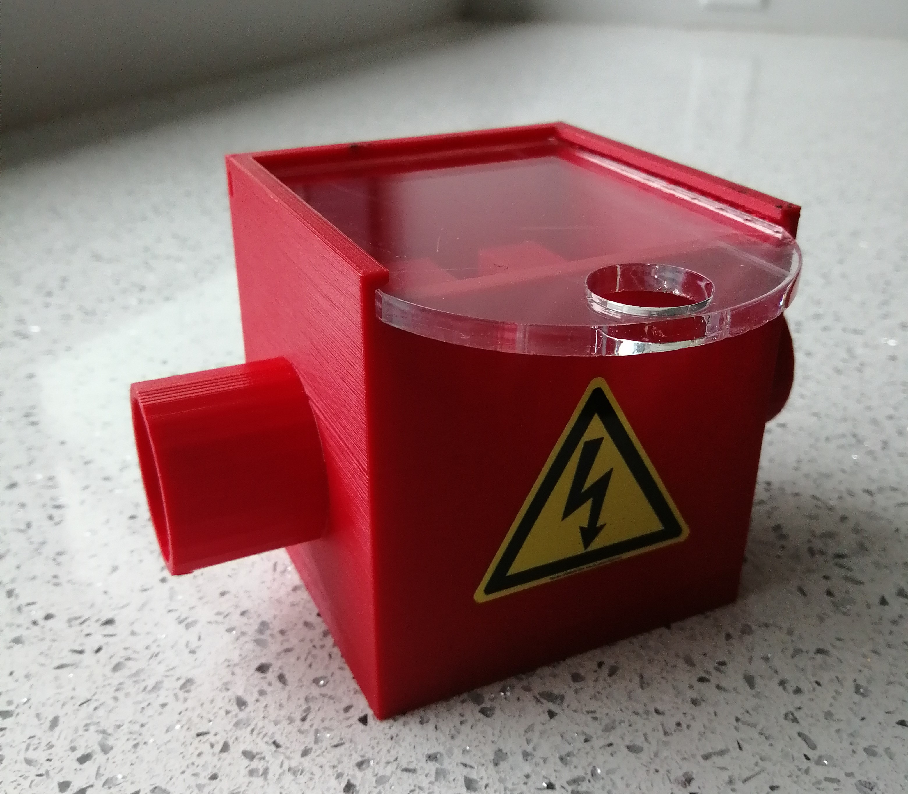

<h2>
   
<em>Dictyostelium</em> <em>discoideum</em> Electroporator

</h2>

<a href="https://minhaskamal.github.io/DownGit/#/home?url=https://github.com/Dicty-Electroporator/Dicty-Electroporator.github.io/tree/master/Dictyostelium%20discoideum%20Electroporator">Download Project</a>

<strong>Abstract:&nbsp;</strong>Custom-made, inexpensive and open-source electroporation apparatus for <em>Dictyostelium discoideum</em> with all functional modules and peripherals.

<strong>Description:&nbsp;</strong>Electroporation to introduce DNA into cells is a common technique in genetic engineering. Dictyostelium discoideum is a well-established eukaryotic model organism that is frequently genetically modified (transformed). We present here an electroporator capable of high efficiency D. discoideum transformation. Our electroporator consists of a high voltage power supply, pulse generator circuit and cell sample cuvette holder. The power supply is programmed to deliver desired voltage, which when activated by a double-pole, double-throw switch (DPDT below) charges the capacitor. Further switching allows the charged capacitor to deliver a precise, consistent exponential decay wave of the proper duration to the cuvette containing a D. discoideum cell and DNA mixture. The high-voltage circuit is housed in an electrically insulated enclosure - we chose a plastic electrical junction box with appropriate holes for switch mounting and cables to pass.  A 3D printable cuvette holder was designed and is available in .stl, .dwg and .iges formats. An electrophoresis chamber cover with cables was used as an adapter for banana plug/jack connections to the power supply. Integral in development and testing was an inexpensive 1,000-volt digital multimeter. To provide hands-free monitoring of discharge circuit voltage and monitoring of the real-time capacitor voltage, we connected the multimeter to the cuvette holder or to the capacitor plates with 24-inch male-male banana test leads or alligator clips, respectively. At the end of these instructions we have included safety and durability enhancements for a second generation prototype.

<strong>License:&nbsp;</strong>CERN Open Hardware License

<h1>
   
2nd Generation Enhanced Prototype

</h1>

For those concerned with a more durable and potentially safer device we have also constructed and tested an additional prototype with a minimal increase in cost. The second prototype features a soldered breadboard with higher power components. Assembly of the pulse generator circuit is straightforward and can be constructed by a beginner with access to soldering equipment. Improved safety features include an inverted capacitor on a circuit board that is solid state. The second prototype cuvette chamber requires more print media but includes an enclosure with more limited access to the power connectors as well as a clear removable lid. The 3D design and print files are available on this page. Note that we chose a biodegradable and fire-resistant 3D print media. There are other cost effective, readily available, and more durable print media available. The enhanced system was tested and performs as efficiently as the original prototype.

A soldered Pulse Generator was made with much higher wattage resistors and terminal plugs for the switch.

&nbsp;

For a more durable device 2W-1M Ohm resistors were used for the anti-no-load shutoff resistors R1-R2 and bleed down resistors R9-R12. 8W-100k Ohm resistors were used for charge-side current limiting shutoff resistors R3-R8.

&nbsp;

The components were fixed to the breadboard using the long leads of resistors as traces on the underside of the 8cm x 12cm padboard.

Trimmed resistor terminals were used to create any additional traces. This technique can easily be found on the internet. While the circuit diagram has remained unchanged, the new board layout accommodates the lack of premade traces found on solderless breadboards. In addition, two jumper wires were soldered to the component side at each end of the bleed-down resistor array. This modification allows the real-time monitoring of the capacitor voltage during electroporation and provides assurance the capacitor is safe. This is accomplished by connecting the 1kV digital multimeter to the jumper wires using alligator clips passed through newly drilled holes in the enclosure. The same digital multimeter used for performing a functions check may be used.

&nbsp;

<h2>
   
2nd generation enhanced cuvette chamber

</h2>

The second-generation enhanced prototype cuvette holder has several additional safety features. The original cuvette holder is now enclosed in a four-sided box with a removable clear Poly acrylic lid. Collars have been enlarged to add additional protection from shock exposure. Design and print files have been included below and the chamber can be printed either hollow or solid.

<strong>Print File2:&nbsp;<a href="https://github.com/Dicty-Electroporator/Dicty-Electroporator.github.io/raw/master/Enhanced%20Cuvette%20Chamber%203DPrintSTL.stl">Enhanced Cuvette Chamber.stl</a></strong>

<strong>CAD Design File2:&nbsp;<a href="https://github.com/Dicty-Electroporator/Dicty-Electroporator.github.io/raw/master/Enhanced%20Cuvette%20Chamber%20CAD.dwg">Enhanced Cuvette Chamber.dwg</a></strong>

FreeCAD Open Source IGES Design File: Available in Download Project top of page

<strong>Enclosure Lid Print File:&nbsp;<a href="https://github.com/Dicty-Electroporator/Dicty-Electroporator.github.io/raw/master/Enclosure%20Lid%20STL.stl">Enclosure Lid STL.stl</a></strong>

<strong>Enclosure Lid CAD Design File:&nbsp;<a href="https://github.com/Dicty-Electroporator/Dicty-Electroporator.github.io/raw/master/Enclosure%20Lid%20CAD.dwg">Enclosure Lid CAD.dwg</a></strong>

Laser Cut Enclosure Lid SVG File: Available in Download Project top of page

FreeCAD Open Source IGES Design File: Available in Download Project top of page

&nbsp;

<h2>
   
Additional parts required for the enhanced prototype

</h2>
<table>
   <thead>
      <tr>
         <td>
            
<strong>Part</strong>

         </td>
         <td>
            
<strong>Quantity</strong>

         </td>
         <td>
            
<strong>Supplier</strong>

         </td>
         <td>
            
<strong>Supplier part number</strong>

         </td>
         <td>
            
<strong>URL</strong>

         </td>
      </tr>
   </thead>
   <tr>
      <td>
         
Power supply banana plug test leads 60 inch

      </td>
      <td>
         
1-2

      </td>
      <td>
         
Mouser

      </td>
      <td>
         
4911A-60/4911A-62

      </td>
      <td>
         
<a href="https://www.mouser.com/Search/Refine?Keyword=4911a-60">www.mouser.com</a>

      </td>
   </tr>
   <tr>
      <td>
         
PCB Prototype padboard - 8cm x 12cm

      </td>
      <td>
         
1

      </td>
      <td>
         
Amazon

      </td>
      <td>
         
739340318574

      </td>
      <td>
         
<a href="https://www.amazon.com/gp/product/B07Y3DVM1W/ref=ppx_yo_dt_b_asin_title_o05_s00?ie=UTF8&psc=1">www.amazon.com</a>

      </td>
   </tr>
   <tr>
      <td>
         
Resistors - 8W-100k Ohm

      </td>
      <td>
         
6

      </td>
      <td>
         
Mouser

      </td>
      <td>
         
279-ROX8J100K

      </td>
      <td>
         
<a href="https://www.mouser.com/ProductDetail/TE-Connectivity-Holsworthy/ROX8J100K?qs=gZXFycFWdAMYKZPoGrub8g%3D%3D">www.mouser.com</a>

      </td>
   </tr>
   <tr>
      <td>
         
Resistors - 2W-1M Ohm

      </td>
      <td>
         
6

      </td>
      <td>
         
Mouser

      </td>
      <td>
         
594-5083NW1M000J

      </td>
      <td>
         
<a href="https://www.mouser.com/ProductDetail/Vishay-BC-Components/PR02000201004JR500?qs=LCMWAU1DZcwmgZ1lvVsGww%3D%3D">www.mouser.com</a>

      </td>
   </tr>
   <tr>
      <td>
         
Bio-Rad Model 3000xi Computer Controlled Electrophoresis Power Supply

      </td>
      <td>
         
1

      </td>
      <td>
         
ebay

      </td>
      <td>
         
    

      </td>
      <td>
         
<a href="https://www.ebay.com">www.ebay.com</a>

      </td>
   </tr>
   <tr>
      <td>
         
3-Pin 5.08mm Pitch Male Female Plug-in PCB Screw Terminal Block Connector

      </td>
      <td>
         
2

      </td>
      <td>
         
Amazon

      </td>
      <td>
         
0766832280286

      </td>
      <td>
         
<a href="https://www.amazon.com/PoiLee-5-08mm-Female-Terminal-Connector/dp/B07TQLYQ7W/ref=asc_df_B07TQLYQ7W/?tag=hyprod-20&linkCode=df0&hvadid=385629037133&hvpos=&hvnetw=g&hvrand=8172029133657464055&hvpone=&hvptwo=&hvqmt=&hvdev=c&hvdvcmdl=&hvlocint=&hvlocphy=9005131&hvtargid=pla-846156762614&psc=1&tag=&ref=&adgrpid=73872201970&hvpone=&hvptwo=&hvadid=385629037133&hvpos=&hvnetw=g&hvrand=8172029133657464055&hvqmt=&hvdev=c&hvdvcmdl=&hvlocint=&hvlocphy=9005131&hvtargid=pla-846156762614">www.amazon.com</a>

      </td>
   </tr>
</table>
